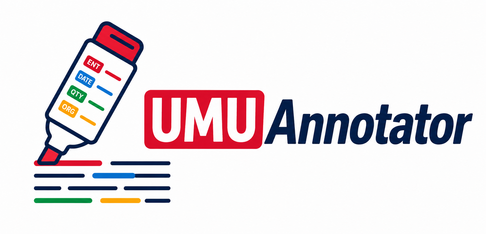

<p align="center">
  
</p>


# UMUAnnotator

UMUAnnotator is a modular annotation framework for enriching text with semantic, linguistic and structured information.

The project is designed around independent annotators that can be combined into annotation pipelines and executed from the command line, Python code or future web services.

## Features

* Configuration-driven annotation pipelines using YAML
* Ontology-based semantic annotation with OWL/RDF
* Temporal annotation using Duckling
* Quantity annotation using Duckling + optional Stanza preprocessing
* Linguistic preprocessing with Stanza and local cache
* Named Entity Recognition with Stanza
* Dictionary and regex-based annotation
* Annotation conflict resolution
* TF-IDF and ontology-aware TF-IDF expansion
* Input formats: CSV, JSONL and plain text
* Output formats: JSON, JSONL and text
* Console and HTML rendering
* Unix-style pipelines using stdin/stdout

## Installation

```bash
pip install -e .
```

## Quick start

Run a configured annotation pipeline over a CSV file:

```bash
mkdir -p outputs

umuannotator run \
  --config configs/pizza_rich.yml \
  --input datasets/pizza_es.csv \
  --text-column text \
  --output outputs/pizza_rich.json
```

Render the result as HTML:

```
umuannotator render html \
  --input outputs/pizza_rich.json \
  --output outputs/pizza_rich.html \
  --title "Pizza Rich"
```

Or run and render in a single pipeline:

```
umuannotator run \
  --config configs/pizza_rich.yml \
  --input datasets/pizza_es.csv \
  --input-format csv \
  --text-column text \
  --output - \
  --output-format jsonl \
  --output-profile full \
  --no-progress \
| umuannotator render html \
    --input - \
    --input-format jsonl \
    --output outputs/pizza_rich.html \
    --title "Pizza Rich"
```

## Input and output formats
UMUAnnotator can read from files or from standard input: CSV, JSONL y plain text.

When input or output formats are omitted, they are inferred from file extensions when possible.


## Annotation Salience

`metrics salience` calcula un ranking global de anotaciones relevantes dentro de un corpus anotado.

A diferencia de `metrics summary`, que muestra conteos descriptivos, `salience` intenta responder a la pregunta:

> ¿Qué anotaciones son más informativas o características dentro de este corpus?

La primera versión usa una métrica sencilla basada en **TF**, **DF**, **IDF** y **TF-IDF** sobre anotaciones.

---

### Qué mide

Para cada anotación se calcula una clave canónica y se agregan sus apariciones en el corpus.

Las métricas son:

| Métrica | Significado |
|---|---|
| `TF` | Número total de veces que aparece una anotación en el corpus |
| `DF` | Número de documentos distintos en los que aparece |
| `IDF` | Rareza documental de la anotación |
| `score` | `TF * IDF` |

La fórmula usada para `IDF` es suavizada:

```text
idf = log((N + 1) / (df + 1)) + 1
```

donde:

```text
N  = número total de documentos
df = documentos donde aparece la anotación
```

---

### Diferencia entre `summary` y `salience`

`summary` responde:

```text
¿Qué hay en este corpus?
```

Ejemplo:

```bash
umuannotator metrics summary \
  --input annotations.jsonl \
  --input-format jsonl \
  --top 20
```

`salience` responde:

```text
¿Qué anotaciones parecen más relevantes?
```

Ejemplo:

```bash
umuannotator metrics salience \
  --input annotations.jsonl \
  --input-format jsonl \
  --top 20
```

---

### Canonical key

Para no contar sólo formas superficiales de texto, cada anotación se convierte en una clave canónica.

La prioridad actual es:

```text
1. metadata.concept_uri
2. metadata.wikidata
3. metadata.normalized + metadata.unit
4. metadata.normalized + metadata.grain
5. metadata.normalized
6. text normalizado en minúsculas
```

Ejemplos:

```json
{
  "text": "Gobierno",
  "layer": "ontology",
  "label": "Government",
  "metadata": {
    "concept_uri": "http://example.org/Government"
  }
}
```

genera:

```text
concept_uri:http://example.org/Government
```

```json
{
  "text": "España",
  "layer": "entity",
  "label": "COUNTRY",
  "metadata": {
    "wikidata": "Q29"
  }
}
```

genera:

```text
wikidata:Q29
```

```json
{
  "text": "2500 euros",
  "layer": "cantidades",
  "label": "MONEY",
  "metadata": {
    "normalized": 2500,
    "unit": "EUR"
  }
}
```

genera:

```text
normalized:2500|unit:EUR
```

```json
{
  "text": "2026",
  "layer": "temporal",
  "label": "DATE",
  "metadata": {
    "normalized": "2026-01-01",
    "grain": "year"
  }
}
```

genera:

```text
normalized:2026-01-01|grain:year
```

---

### Ejemplo auto-contenido

Crea un fichero de ejemplo:

```bash
cat > /tmp/umu_salience_example.jsonl <<'JSONL'
{"text":"El Gobierno anuncia ayudas hoy.","annotations":[{"start":3,"end":11,"text":"Gobierno","label":"Government","layer":"ontology","source":"ontology","metadata":{"concept_uri":"http://example.org/Government"}},{"start":26,"end":29,"text":"hoy","label":"DATE","layer":"temporal","source":"duckling-temporal","metadata":{"normalized":"2026-06-30","grain":"day"}}]}
{"text":"El Gobierno confirma nuevas medidas.","annotations":[{"start":3,"end":11,"text":"Gobierno","label":"Government","layer":"ontology","source":"ontology","metadata":{"concept_uri":"http://example.org/Government"}}]}
{"text":"España invertirá 2500 euros en el proyecto.","annotations":[{"start":0,"end":6,"text":"España","label":"COUNTRY","layer":"entity","source":"pattern","metadata":{"wikidata":"Q29"}},{"start":17,"end":27,"text":"2500 euros","label":"MONEY","layer":"cantidades","source":"duckling-quantity","metadata":{"normalized":2500,"unit":"EUR"}}]}
JSONL
```

Ejecuta `summary`:

```bash
umuannotator metrics summary \
  --input /tmp/umu_salience_example.jsonl \
  --input-format jsonl \
  --top 10
```

Ejecuta `salience`:

```bash
umuannotator metrics salience \
  --input /tmp/umu_salience_example.jsonl \
  --input-format jsonl \
  --top 10
```

Salida esperada aproximada:

```text
Annotation salience

Documents: 3

Top salient annotations
┏━━━━━━━┳━━━━┳━━━━┳━━━━━━━┳━━━━━━━━━━━━┳━━━━━━━━━━━━┳━━━━━━━━━━━━━┳━━━━━━━━━━━━━━━━━━━━━━━━━━━━━━━━━━━━━━┓
┃ Score ┃ TF ┃ DF ┃ IDF   ┃ Layer      ┃ Label      ┃ Display     ┃ Canonical                            ┃
┡━━━━━━━╇━━━━╇━━━━╇━━━━━━━╇━━━━━━━━━━━━╇━━━━━━━━━━━━╇━━━━━━━━━━━━━╇━━━━━━━━━━━━━━━━━━━━━━━━━━━━━━━━━━━━━━┩
│ 2.575 │ 2  │ 2  │ 1.288 │ ontology   │ Government │ Gobierno    │ concept_uri:http://example.org/...   │
│ 1.693 │ 1  │ 1  │ 1.693 │ temporal   │ DATE       │ hoy         │ normalized:2026-06-30|grain:day     │
│ 1.693 │ 1  │ 1  │ 1.693 │ entity     │ COUNTRY    │ España      │ wikidata:Q29                         │
│ 1.693 │ 1  │ 1  │ 1.693 │ cantidades │ MONEY      │ 2500 euros  │ normalized:2500|unit:EUR             │
└───────┴────┴────┴───────┴────────────┴────────────┴─────────────┴──────────────────────────────────────┘
```

---

### Filtrar por capa

Para analizar sólo ontología:

```bash
umuannotator metrics salience \
  --input /tmp/umu_salience_example.jsonl \
  --input-format jsonl \
  --layer ontology \
  --top 10
```

Para analizar sólo temporales:

```bash
umuannotator metrics salience \
  --input /tmp/umu_salience_example.jsonl \
  --input-format jsonl \
  --layer temporal \
  --top 10
```

Para analizar sólo cantidades:

```bash
umuannotator metrics salience \
  --input /tmp/umu_salience_example.jsonl \
  --input-format jsonl \
  --layer cantidades \
  --top 10
```

---

### Filtrar por etiqueta

Por ejemplo, sólo fechas:

```bash
umuannotator metrics salience \
  --input /tmp/umu_salience_example.jsonl \
  --input-format jsonl \
  --label DATE \
  --top 10
```

Sólo dinero:

```bash
umuannotator metrics salience \
  --input /tmp/umu_salience_example.jsonl \
  --input-format jsonl \
  --label MONEY \
  --top 10
```

---

### Uso con pipes

`metrics salience` puede leer desde `stdin`.

Ejemplo con un fichero JSONL ya anotado:

```bash
cat /tmp/umu_salience_example.jsonl \
| umuannotator metrics salience \
    --input - \
    --input-format jsonl \
    --top 10
```

Ejemplo encadenado con `run`:

```bash
umuannotator run \
  --config configs/news.yml \
  --input headlines.csv \
  --input-format csv \
  --text-column headline \
  --output - \
  --output-format jsonl \
  --no-progress \
| umuannotator metrics salience \
    --input - \
    --input-format jsonl \
    --top 20
```

---

### Interpretación

Un valor alto de `score` puede deberse a dos razones:

```text
- La anotación aparece muchas veces.
- La anotación aparece en pocos documentos y por tanto es más específica.
```

Por ejemplo, `Gobierno` puede tener un `TF` alto porque aparece en muchos titulares.

En cambio, `2500 euros` puede tener un `DF` bajo pero un `IDF` alto porque aparece en pocos documentos.

---

### Limitaciones actuales

La primera versión de `salience` no corrige anotaciones ni resuelve falsos positivos.

Si una ontología anota:

```text
Madrid → RealMadrid
```

`salience` lo contará como tal. Esto es útil como feedback para revisar la ontología o las reglas de matching, pero no es responsabilidad de esta métrica corregirlo.

Tampoco aplica todavía pesos por capa, confianza, posición en el documento ni resolución semántica entre capas.

---

### Relación con futuras mejoras

`salience` empieza usando TF-IDF general sobre anotaciones, pero puede crecer hacia una métrica más rica incorporando:

```text
- pesos por capa
- confidence
- evidence
- posición en el documento
- resolución semántica
- canonicalización avanzada
- expansión ontológica tipo TF-IDF-e
```

Por ahora, el objetivo es ofrecer un ranking global simple, explicable y útil para explorar corpus anotados.


## Ontology utilities

Show ontology statistics:

```bash
umuannotator ontology info \
  --config configs/pizza_rich.yml
```

List ontology concepts:

```bash
umuannotator ontology concepts \
  --config configs/pizza_rich.yml
```

Inspect semantic distances:

```bash
umuannotator ontology distances \
  --config configs/pizza_rich.yml \
  --concept HawaianPizza
```

Inspect generated graph relations:

```bash
umuannotator ontology relations \
  --config configs/pizza_rich.yml
```

## Project structure

```text
umuannotator/
├── annotators/
├── preprocessors/
├── ontology/
├── metrics/
├── renderers/
├── document/
├── pipeline/
├── io/
└── cli/
```


## Status

UMUAnnotator is under active development.

The architecture is stable enough for experimentation and research workflows, while additional annotators, metrics and ontology features continue to be added.

## License

MIT License
